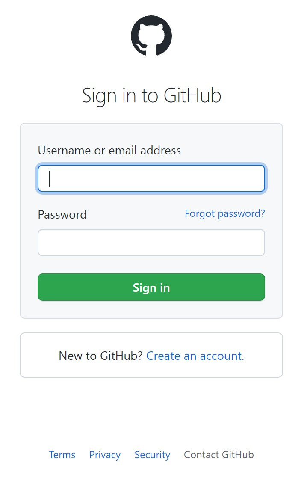

```
  everything above the pragma definition is not included as a part of the tutorial
  All italicized text in this template must be replaced by your own
```
| pragma | osaes 0.0.1 |
| ------ | ----------- |
| published | false |

# _Replace with title of the project the learner will be able to build after this tutorial_

_Replace this paragraph with description of project. Make sure the title of the project is something that the learner will be able to do - something that she could previously not do. This will motivate the learner to stick around till the end. In the description clearly layout _what it means_ to build this project. Why should the learner learn the skill being taught in this tutorial._

### Pre-requisites
_Replace this line with what this tutorial assumes. Additionally, you may also use a list to layout what all the user should know before attempting this tutorial._
- _python3_
- _You can also add required readings like the following_
- _Completed tutorial at [https://github.com/username/repo/LEARN.md](https://github.com/username/repo/LEARN.md)_

## Snippet 1 : _Replace with title of the instruction_
_Replace paragraph with the description of what the user will be able to do by looking at this snippet_
### Instruction
_Provide what the learner must do now. Ideally get to building something asap._

```
  Snippets can be of type : code embed or a screenshot. 
  See snippets below for more examples
```
### Desired output
_What will happen because of following the said instruction. Keep it short. See below for examples_

### Learning
_Describe why is that interesting. Getting a desired output is one thing, but clearly describe why the said output is required in our journey towards the project that we have set out to build by means of this tutorial. Err on the side of explaining a little too much. Feel free to keep it informal and entertaining._


## Snippet 2 : Snippet with code
In this snippet, we'll look at how to embed code in our `LEARN.md` file

### Instruction
Use 3 backticks to start a code snippet, just like you would in a `md` file. 

```
def main():
  print("hello world")
```


### Desired output
Your code will show up in the snippet, the language will be autodetected for code highlighting

### Learning
By using code in our snippets we will be quickly able to get our learners to start *doing* something asap

## Snippet 3 : Snippet with screenshot
We can also add snippets to our code. The image must be uploaded to the repository itself.



### Desired output
You can show a screenshot to describe the UI of tools people need to use as a part of this tutorial

### Learning
By using screenshots you can make the user more familiar with the tools that they need to be using. Also, adding images makes people relate the fact that what they're seeing on their computer and what is mentioned in the screenshot is actually the same. Giving them reassurance that they are on the right track.

## Project work
_Replace with a project that people must complete at the end of this tutorial._ 
As a part of this `LEARN.md`, create a LEARN.md file in your repo. You can defined test cases that users need to pass so as to be able to complete this tutorial.

### Test cases
| comilation docker image | https://github.com/CreatorOS/osaes-images/docker-compilation-image1 |
| deployment docker image | https://github.com/CreatorOS/osaes-images/docker-deployment-image1 |
| compilation command | you can use $DIR to substitute for the submitted project root directory |
| deployment command | again, you can use $DIR for submission root directory |
| expected output | https://github.com/username/repo/learn\_assets/expected\_output.txt | 


